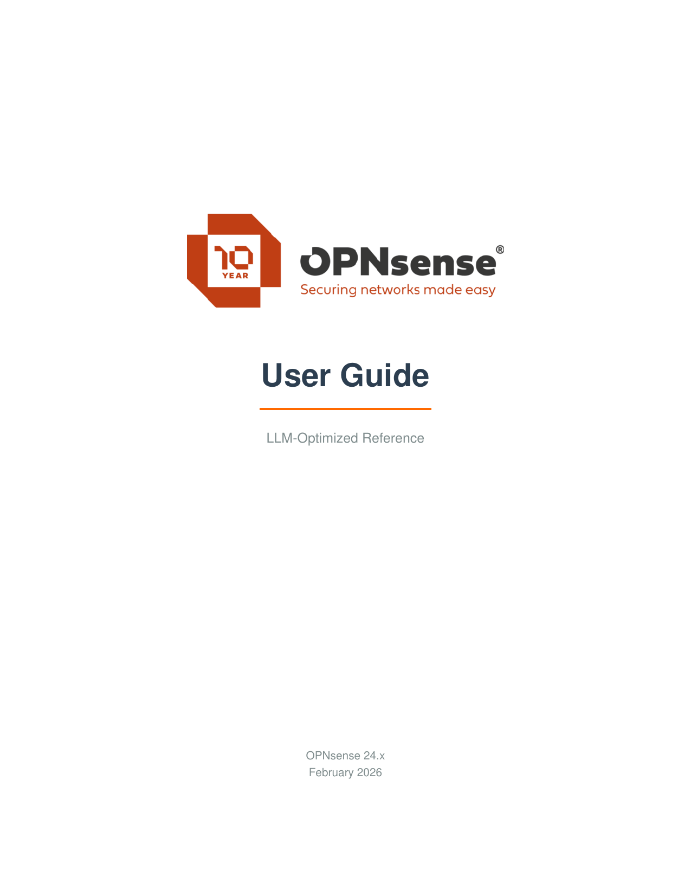
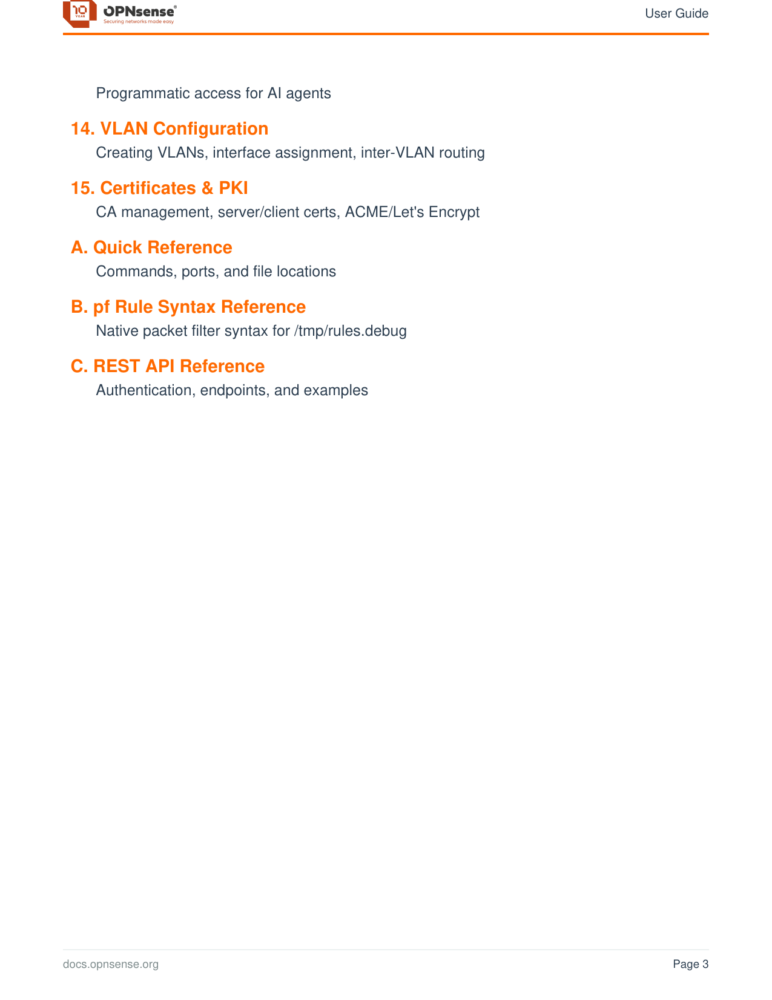
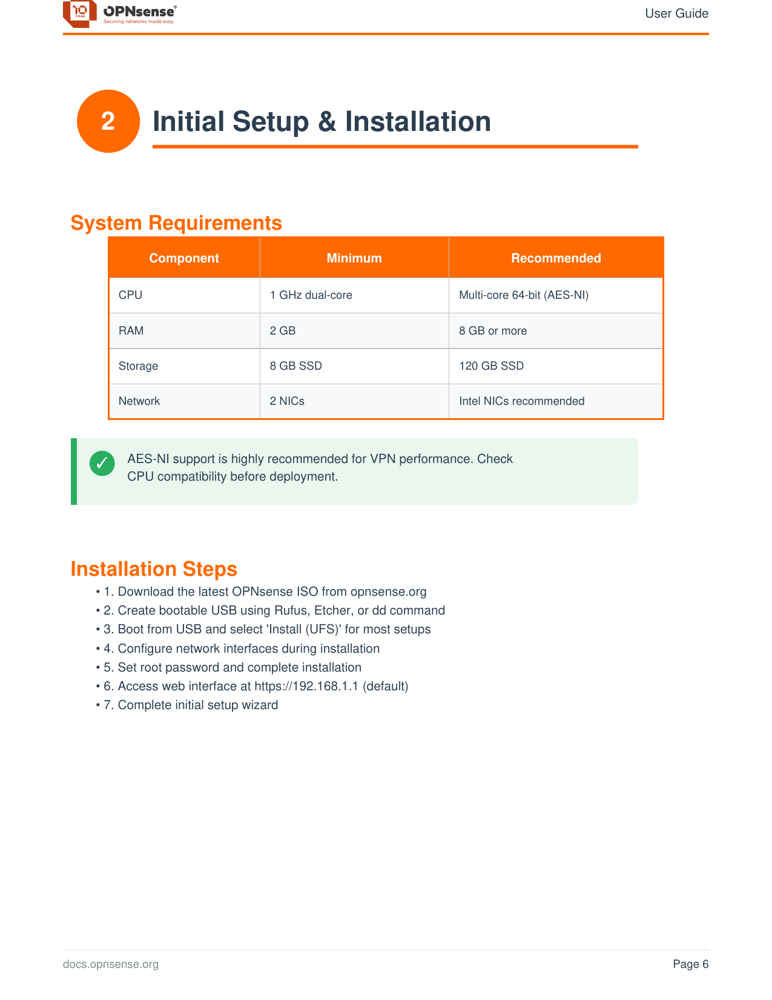
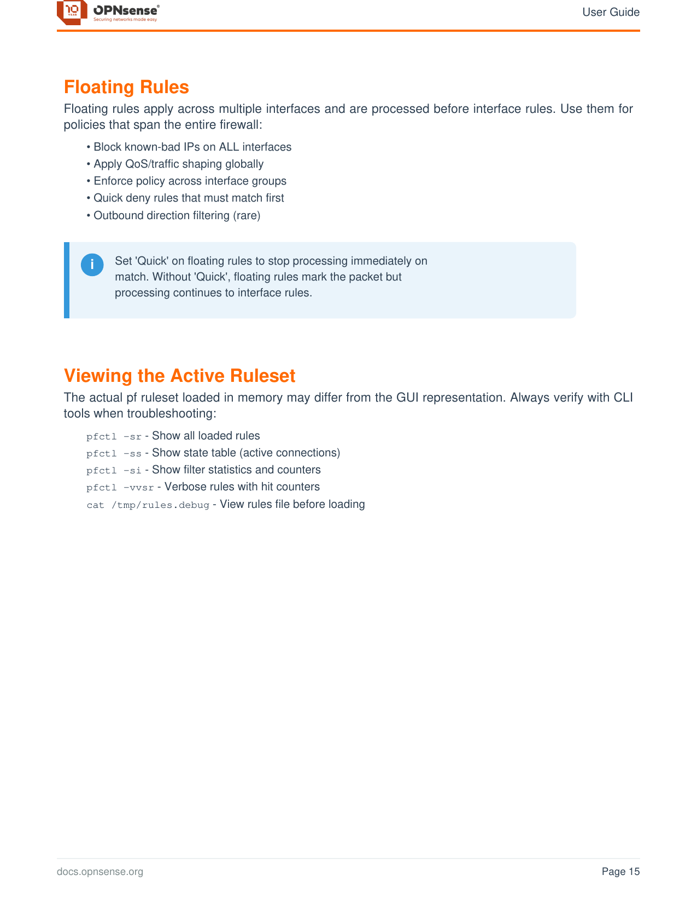

# OPNsense MCP/LLM Toolkit

Configure your OPNsense firewall using natural language with any MCP-compatible LLM.

<p align="center">
  
</p>

## What This Is

A complete toolkit that lets you use Claude, Cursor, OpenCode, or other LLMs to configure OPNsense firewalls through conversation. Includes an enhanced MCP server with additional tools for WireGuard, PF states, gateways, and aliases.

```
"Create a guest VLAN that can access the internet but not my LAN"
"Forward port 443 to my web server at 192.168.1.50"  
"Show me all firewall rules blocking traffic"
"Check WireGuard tunnel status"
```

---

## Quick Start

1. **Get API credentials** from OPNsense (System > Access > Users > API keys)
2. **Install and run the MCP server**:
   ```bash
   cd opnsense-mcp-server
   npm install
   npm run build
   ```
3. **Add MCP server** to your LLM client config:
   ```json
   {
     "mcpServers": {
       "opnsense": {
         "command": "node",
         "args": ["/path/to/opnsense-mcp-server/dist/index.js"],
         "env": {
           "OPNSENSE_HOST": "https://192.168.1.1",
           "OPNSENSE_API_KEY": "your_key",
           "OPNSENSE_API_SECRET": "your_secret",
           "OPNSENSE_VERIFY_SSL": "false"
         }
       }
     }
   }
   ```
4. **Add the system prompt** from `llm/SYSTEM_PROMPT.md` to your LLM's instructions
5. **Start chatting** - "Test my OPNsense connection"

**Full setup instructions:** [SETUP.md](SETUP.md)

---

## User Guide Preview

The toolkit includes a comprehensive 78-page PDF guide covering everything from initial setup to advanced configurations.

<p align="center">
  
  
</p>

<p align="center">
  
</p>

<p align="center">
  <a href="docs/OPNsense_User_Guide.pdf"><strong>Download Full PDF Guide</strong></a>
</p>

---

## What's Included

| Directory/File | Purpose |
|----------------|---------|
| `opnsense-mcp-server/` | Enhanced MCP server with WireGuard, PF states, gateway, alias tools |
| `llm/SYSTEM_PROMPT.md` | Copy-paste prompt for your LLM |
| `llm/OPNSENSE_KNOWLEDGE.md` | Detailed reference (MCP tools, workflows, patterns) |
| `docs/OPNsense_User_Guide.pdf` | 78-page human-readable guide |
| `SETUP.md` | Step-by-step setup instructions |

## MCP Server Features

Enhanced from the base opnsense-mcp-server with:
- **WireGuard tools** - Tunnel status, peer management
- **PF state tools** - View/clear packet filter states
- **Gateway tools** - Monitor gateway status and failover
- **Alias tools** - Manage firewall aliases
- **SSH support** - Direct CLI access for advanced operations

---

## How It Works

```
┌─────────────┐     ┌─────────────┐     ┌─────────────┐
│   You       │────>│   LLM       │────>│  OPNsense   │
│  (natural   │     │ (with MCP   │     │  (firewall) │
│  language)  │<────│  tools)     │<────│             │
└─────────────┘     └─────────────┘     └─────────────┘
                          │
                    MCP Server +
                    Knowledge Base
```

The LLM uses:
- **MCP tools** to execute commands on OPNsense (API + SSH)
- **Knowledge files** to understand OPNsense concepts and best practices
- **System prompt** to follow safety guidelines (backup first, explain changes, etc.)

---

## Requirements

- OPNsense firewall with API access enabled
- LLM client with MCP support (Claude Desktop, Cursor, OpenCode, Continue.dev)
- Node.js 18+

## Project Structure

```
OPNsense-MCP-LLM-Toolkit/
├── README.md
├── SETUP.md                     # Setup instructions
├── opnsense-mcp-server/         # Enhanced MCP server
│   ├── src/                     # Server source code
│   ├── package.json
│   └── README.md                # Server-specific docs
├── llm/
│   ├── SYSTEM_PROMPT.md         # LLM instructions
│   └── OPNSENSE_KNOWLEDGE.md    # Reference material
├── docs/
│   ├── OPNsense_User_Guide.pdf  # Full PDF guide
│   └── images/                  # Preview images
└── src/
    └── opnsense_user_guide.py   # PDF generator
```

---

## License

MIT

---

*Not affiliated with the OPNsense project. OPNsense is a trademark of Deciso B.V.*
